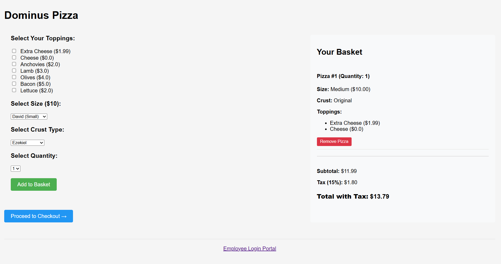
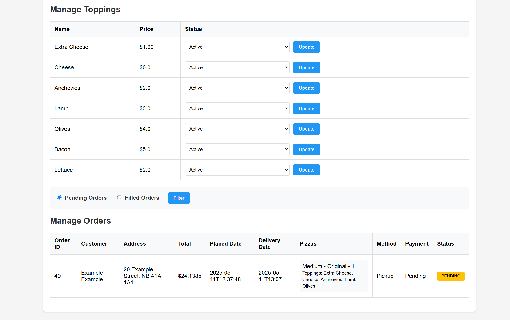
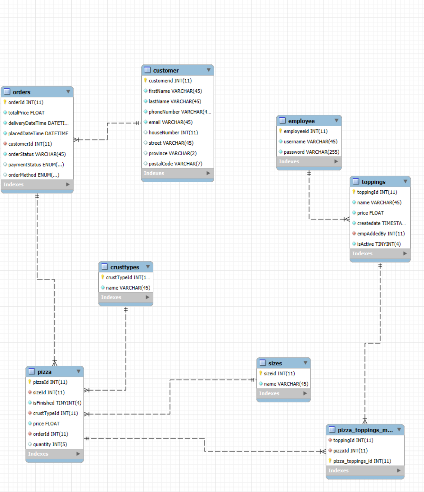

# Dominus-Pizza
**NOTE 1: Plain text password is done intentionally for dev environment set up.**

**NOTE 2: A default DB and most dependencies are already defined in the pom.xml file.**

🍕 A full-stack Java EE web application for ordering custom Mediterranean pizzas online with comprehensive business logic.

# 🔍 Overview
This Online Pizza Ordering System demonstrates my understanding and skills in enterprise Java web development.

It allows customers to:

🍕 Create custom pizzas with various toppings and crusts

🛒 Add multiple pizzas to shopping cart

💳 Pay online or choose cash on delivery

🏠 Choose between home delivery or pickup

📋 Receive order confirmations with estimated delivery times

Employees can:

🔑 Access administrative functions through secure login

🧀 Manage available pizza toppings

📦 Track and update order status

# 🌐 Frontend
📄 JSP/JSF pages

🎨 CSS3

💻 JavaScript

📱 Responsive design principles

# ⚙️ Backend
☕ Java EE

🧩 Enterprise JavaBeans (EJB)

🗄️ MySQL database

🔌 Three-tier architecture

# 🏗️ Architecture

This application implements a proper three-layer architecture:

1️⃣ Presentation Layer

JSP/JSF pages for the user interface

Servlets as controllers handling HTTP requests

Client-side validation with JavaScript

2️⃣ Business Layer

Enterprise JavaBeans (EJBs) encapsulating business logic

Service classes implementing business rules

Validation and exception handling

3️⃣ Data Access Layer

Entity classes mapping to database tables

EJB-based CRUD operations

Data transfer objects (DTOs) for efficient data exchange

# 🧩 OOP Principles
The application strictly follows object-oriented programming principles (wherever possible):

Encapsulation: Private fields with getters/setters

Inheritance: Base classes extended for specialized functionality

Polymorphism: Interface implementations for flexible component design

Abstraction: Abstract classes and interfaces hiding implementation details

# 🗄️ Database Design
The database schema follows proper relational database design principles:

Normalized tables (3NF) to minimize redundancy

Appropriate primary and foreign keys

Proper indexes for performance optimization

Constraints ensuring data integrity

# ⚙️ Tools

NetBeans

MySQL WorkBench

GlassFish/Payara Server

# 📦 Dependencies

JDK 21 (JDK 22 and up do not work)

Jakarta EE 10

MySQL Connector/J

JSF 3.0 (optional for JSF pages)

JSTL 2.0 (for JSP pages)

# ✨ Features
🖱️ Intuitive UI: Clean, user-friendly interface for pizza customization and ordering

🍕 Custom Pizza Builder: Interactive topping and crust selection

📊 Order Management: Complete order tracking for both customers and employees

📱 Responsive Design: Works seamlessly across desktop and mobile devices

🛡️ Error Handling: Comprehensive validation and exception management

💳 Payment Integration: PayPal payment gateway support

🔐 Secure Admin Area: Role-based access control for employees

# 🚀 Installation

1. Download the project ZIP file

2. Extract the ZIP file to get the pizza-ordering-system folder

3. Install JDK 21 if not already installed

4. Install NetBeans IDE with Java EE support

**DB Setup:**

1. Open MySQL Workbench

2. Import the provided SQL script to create tables

**Set up GlassFish in NetBeans:**

1. Go to Tools > Servers

2. Click "Add Server"

3. Select GlassFish Server and click Next

4. Browse to the GlassFish installation directory or use the download option

5. Click Finish

**Configure default web browser (optional):**

1. Go to Tools > Options

2. Select the Web Browser category

3. Choose your preferred browser for viewing web applications

**Open the project in NetBeans:**

1. Go to File > Open Project

2. Navigate to the extracted folder

3. Select the project and click Open

**Build and deploy the application:**

1. Right-click on the project in the Projects panel

2. Select "Clean and Build"

3. Right-click again and select "Run"

NetBeans will automatically start GlassFish and deploy the application.

# 🎓 Learning Outcomes

This project demonstrates my proficiency in:

🏗️ Enterprise Java application architecture

🔐 Authentication and authorization implementation

🗄️ Database design and ORM operations

🏆 Business logic implementation with EJBs

🧩 MVC design pattern

🎨 UI/UX design principles

🐞 Error handling and validation techniques

📝 Code organization and documentation
